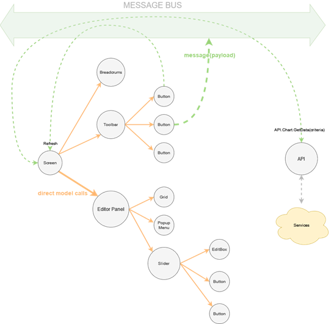

# Component Integration Model

The UEC architecture employs two primary methods for component interaction: direct model calls and communication through a common message bus. Each method serves distinct purposes and maintains different aspects of component interaction.

## 1. Direct Model Calls

In parent-child relationships, direct model calls are the primary method for building component blocks. This interaction is always inward, meaning communication flows from the parent component to its child components, and from those child components to their own children. This hierarchical structure ensures that each component only interacts with its direct descendants, maintaining a clear and readable codebase.

- **Parent-to-Child Communication**: Direct calls facilitate straightforward and efficient data passing and method invocation within the component hierarchy.
- **Avoiding Child-to-Parent Calls**: Although technically possible, accessing the parent model directly from a child component is discouraged. It can lead to hard-to-read code and introduce non-obvious logic issues.

## 2. Message Bus Interaction

Interaction through the message bus involves components subscribing to and publishing messages on a shared communication channel. This method is essential for decoupling components and promoting modularity.

- **Message Registration**: Before components can interact through the message bus, message signatures must be registered. This includes the message ID, the input parameter type, and the returned result type.
- **Subscription and Messaging**: Any component can subscribe to receive specific messages from the bus. Upon receiving a message, the subscribed component executes a predefined reaction. Similarly, any component can publish messages to the bus, triggering reactions in all subscribed components.
- **Loose Coupling**: By isolating the logic of different system levels, the message bus ensures loose coupling between components. This separation is crucial for maintaining independent and modular components.
- **Use Cases**: The message bus is ideal for calling server API methods, displaying dialogs, and managing global notifications. It also simplifies modular testing by eliminating code dependencies between modules.

## Diagram Explanation

The attached diagram illustrates the two types of component interaction:

- **Direct Model Calls**:
  - **Screen to Editor Panel**: The Screen component directly interacts with the Editor Panel, passing data and invoking methods.
  - **Editor Panel to Grid, Popup Menu, and Slider**: The Editor Panel further interacts with its child components, maintaining a hierarchical communication flow.

- **Message Bus Interaction**:
  - **Breadcrumbs, Toolbar, and Buttons**: These components can send messages to the message bus, which other components can subscribe to and react upon.
  - **API and Services**: Server API methods and services communicate through the message bus, enabling asynchronous and decoupled interactions.

The diagram visually represents these interactions, emphasizing the dual approach to component communication:

- **Solid Arrows (Direct Calls)**: Indicate direct model calls within the parent-child hierarchy.
- **Dashed Arrows (Message Bus)**: Represent message-based communication, illustrating how components interact through the common message bus.

## Conclusion

By utilizing these two methods, the UECA ensures clear, maintainable, and scalable component interactions. This approach not only improves code readability and modularity but also facilitates testing and reduces the likelihood of bugs.
