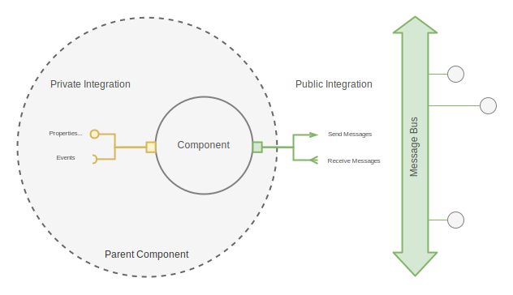

# Component Mental Model

## Rationale of creating UECA

In UI application development, the component approach is widely used, where the user interface is constructed from various unified parts called components. React, as a framework, is based on this model. However, standard React patterns often require developers to focus heavily on the interactions between these components, leading to redundant code and inconsistencies, especially in larger teams. This redundancy increases support costs and the likelihood of bugs over time.

## What is UECA component?
The UECA addresses the issue by encapsulating routine code and allowing developers to focus on the core principles of components. Here are the fundamental principles, visualized in the provided diagram.

- **Component as a Black Box**: A component is a self-contained unit for external observers, encapsulating its internal logic and state.
- **Internal State**: Each component has an internal state represented by properties, which can be accessed and modified.
- **Internal Events**: Components can trigger internal events, which external logic can react to.
- **Methods**: Components can have methods to alter their internal state, retrieve data, and trigger events.
- **Children (Recurrent Structure)**: Components can contain other components (children), which follow the same principles as their parents.
- **Common Message Bus**: Components can communicate through a common message bus. They can post messages to this bus and subscribe to receive messages from it.
- **Presentation View**: If a component is visual, it includes a presentation view in the user interface. In React, this is typically a JSX expression.

## Diagram Explanation

The diagram illustrates the "Component Mental Model," showing the dual aspects of integration for a component:

### Private Integration:

- **Properties**: The internal state variables of the component.
- **Methods**: Functions to manipulate the component's internal state.
- **Events**: Internal triggers that can invoke external logic.
- **Children**: Other components nested within the parent component.
- **View**: The visual representation of the component.

### Public Integration:

- **Send Messages**: External messages sent by the component to the common message bus.
- **Receive Messages**: External messages received by the component through the common message bus.

## Conclusion

This mental model simplifies the development process by abstracting routine code and allowing developers to concentrate on the core logic and interactions of components. By adhering to these principles, teams can reduce redundancy, enhance code maintainability, and improve scalability.
